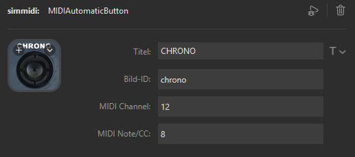
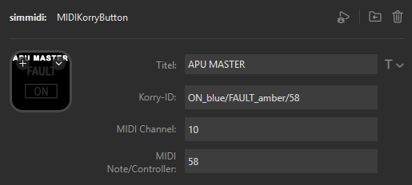

# Using SIM-MIDI with Mobiflight

For using SIM-MIDI with mobiflight prepare your system:

- Create a subfolder 'streamdeck' in the MIDIBoards subfolder of your Mobiflight installation. Put the  [StreamDeck-MIDI-Definition](../mobiflight/streamdeck.midiboard.json) file in that created folder
- Install loopMidi by Tobias Erichsen and Create a 'StreamDeck' loop MIDI Device
- Start Mobiflight and activate MIDI Support and check the StreamDeck-MIDI-Device in the Mobiflight settings
- Create a project and configure or just import a ready made [StreamDeckProfile](../mobiflight/AIRBUS A320.streamDeckProfile) for the Fenix A320 into your StreamDeck App. 

## MIDI Automatic Button

This button can be configured with a caption (Title), an id (important for the png-file), a channel and a note resp. controller number. 
E.g. if you configure your button with the following information:

If you press the button, a MIDI Note on - message, channel 12, note #8 will be sent. If you release the button, the appropriate Note off-Message will be sent.
the button has the id "chrono", so the plugin searches for a "chrono0.png" image in the the plugin's images folder.
The button is automatically configured to listen to a MIDI CC-change on the same channel 12 and controller number 8. If the value is 1, an image "chrono1.png" will be searched in the images folder and will be shown if present. Any value will be appended to chrono, after that ".png" follows.

## MIDI Korry Button
The configuration of a korry button is similar:

Here the APU Master Korry Button will be shown. The magic lies in its ID: the lower Annunciator is a ON in blue. The plugin will search for a ON_grey.png (144x72) in the images folder. When a MidiCC-Message arrives at channel 10 and controller 58 with a value bigger than 0, then the plugin searches for a ON_blue.png in the images folder and puts this as the lower annunciator. The second part of the id does the same with the FAULT_amber.png resp. FAULT_grey.png image. 

For the aupper annunciator the buttons listens to channel + 1, here channel 11 and same controller number.

The korry buttons pngs have to be in the korry subfolder of the images folder.

# MIDI Device Configuration
The provided example has configured all items documented in [the Device-Documentation](streamdeck-devices.md) for the Fenix A320 in the mobiflight folder of this project.
The overhead panel is configured along with some other panels and buttons (e.g. ATCTCAS and Warning Panels).

Please enhance the configuration items!